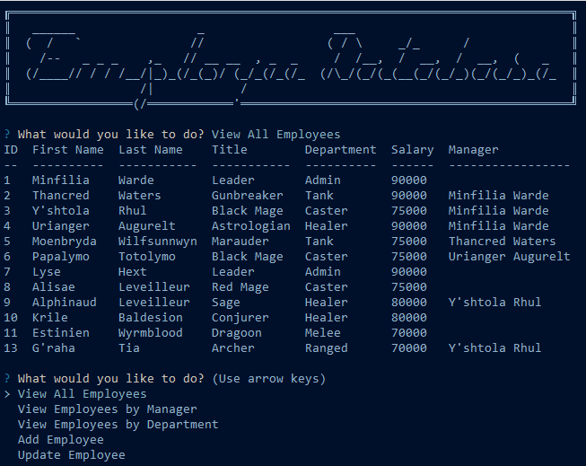

# Employee Database

This is an employee database app that runs in the terminal via [Node](https://nodejs.org/en/). 

It allows access and control of a database of employees, roles (or titles), and departments, each of which can be added to or deleted from via options on the main menu. Each employee has an assigned role and manager, while each role has an associated department, and each of these relationships is maintained by the SQL data structure.

### Video Demo

See a video demonstration [here](https://drive.google.com/file/d/1_ZVsr-zkw9o50OBQKW8zUEYCgLCHE8fz/view?usp=sharing).

---

## Getting Started

These instructions will get you a copy of the project up and running on your local machine for development and testing purposes. 

### Prerequisites

* IDE to view/edit source code (e.g. Visual Studio Code).
* [Node.js](https://nodejs.org/en/)
* [MySQL](https://www.mysql.com/)

### Installing

1. Clone repository.
1. Navigate to `employee-tracker` directory in terminal.
1. `npm install` dependencies.
1. Initialize database in SQL with `source db/schema.sql`.
1. If desired, seed database with `source db/seeds.sql`.
1. Run with `npm start`.

---

## Built With

* [Node.js](https://nodejs.org/en/)
* [Inquirer.js](https://www.npmjs.com/package/inquirer)
* [MySQL2](https://www.npmjs.com/package/mysql2)

## Author

Vince Lee
- [Portfolio](https://starryblue7.github.io/portfolio-ii/)
- [Github](https://github.com/StarryBlue7)
- [LinkedIn](https://www.linkedin.com/in/vince-lee/)

## License

[MIT License](https://vince-lee.mit-license.org/)

## Acknowledgments

* ASCII header generated by Patrick Gillespie's [ASCII Art Generator](https://patorjk.com/software/taag/).
* Data table formatting by [NPM console.table](https://www.npmjs.com/package/console.table).